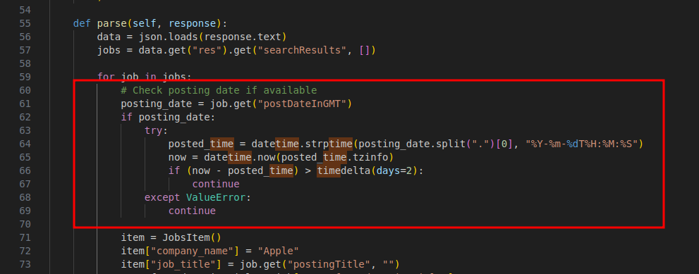

# JobNova Crawler Demo Project Usage Documentation

## Project Overview

This is a web crawler project based on the Scrapy framework, designed to scrape job postings, particularly for specific companies (e.g., Apple). The project uses `uv` as the Python package manager, with dependencies including Scrapy, BeautifulSoup4, Elasticsearch, etc., for data crawling, parsing, and storage.

Project structure:
- `pyproject.toml`: Project configuration and dependency list.
- `jobs/`: Scrapy project directory.
  - `spiders/`: Spider files, e.g., `bs4_Apple.py` (Apple job spider).
  - `settings.py`: Scrapy configuration, including middleware, pipelines, and custom error/tag settings.
  - `pipelines.py`: Data processing pipeline, saves data via API.
  - `items.py`: Defines the scraped item (JobsItem).

The current implementation supports crawling Apple jobs, filtering jobs posted within the last 2 days, checking if the job location is within the monitored range, and analyzing tags via an API.

## Environment Requirements

- Python >= 3.12
- uv (Python package manager): Used to install dependencies and run commands. Install uv: `curl -LsSf https://astral.sh/uv/install.sh | sh`
- Operating System: Linux/MacOS/Windows (tested on Linux).

## Installing Dependencies

1. Clone or navigate to the project directory:
   ```
   cd jobnova-crawler-demo
   ```

2. Use uv to sync dependencies (install all dependencies):
   ```
   uv sync
   ```
   This will install Scrapy and other libraries like beautifulsoup4, elasticsearch, etc., based on `pyproject.toml`.

3. Install Playwright browsers (the project depends on playwright for browser automation):
   ```
   uv run playwright install
   ```
   This will download and install Chromium, Firefox, and WebKit browsers, supporting headless mode crawling.

## Running the Crawler
### 3 Examples in the Project:
JSON-based parsing: `jobs/spiders/bs4_Apple.py` 
BeautifulSoup-based parsing: `jobs/spiders/bs4_Cisco.py`
Playwright-based parsing: `jobs/spiders/pr_bloomberg.py`

### Basic Command

Use the following command to run the Apple job spider:
```
uv run scrapy crawl Apple
or
uv run scrapy crawl "Apple"
```

- **Explanation**:
  - `uv run`: Uses uv to run the command in a virtual environment, ensuring dependencies are correctly loaded.
  - `scrapy crawl Apple`: Starts the spider named "Apple" (defined in `jobs/spiders/bs4_Apple.py`).
  
- **Spider Behavior**:
  - Crawls the Apple official job API (https://jobs.apple.com/api/v1/search).
  - By default, crawls the first 6 pages of jobs, sorted by "newest".
  - Filtering conditions:
    - Only processes jobs posted within the last 2 days.
    - Checks if the job location is within the monitored range defined in `jobs/locations.py`.
    - Uses the API in `jobs/libabang.py` to analyze the job title and obtain tag IDs (skipped if no tags).
  - Data items (JobsItem) include: company name ("Apple"), job title, link, location description.
  - Data is saved through the `SaveByApi` pipeline (configured in settings.py), potentially uploading to an external API or database.

- **Expected Output**:
  - Terminal logs: Show crawling progress, job locations, tag analysis results.
  - Data saving: Job information is processed through the pipeline, possibly outputting to Elasticsearch or other storage (depending on API configuration).
  - Example log:
    ```
    ------------ job_location: Austin, Texas, United States
    ```
  - If no matching jobs, logs may show skip information.

- **Running Results 
  - Normally saved to the `items` directory under the corresponding '[Company Name].json' file**:
  - For job lists that can obtain the posting time, it is necessary to add a judgment on whether the posting time is less than 2 days. We only need jobs posted within 2 days, as shown in the code below: 
  

### Other Running Options

- Run other spiders (if available): Replace "Apple" with another spider name, e.g., "pr_bloomberg" (if implemented).
  ```
  uv run scrapy crawl pr_bloomberg
  ```

- Debug mode: Add `-L DEBUG` to see detailed logs.
  ```
  uv run scrapy crawl Apple -L DEBUG
  ```

- Limit pages: Modify `self.page < 6` in the spider code (currently hardcoded to 6 pages).

## Configuration Instructions

### Scrapy Settings (`jobs/settings.py`)

- **BOT_NAME**: 'jobs' (project name).
- **SPIDER_MODULES**: 'jobs.spiders' (spider location).
- **MIDDLEWARES**:
  - CrawlerSpiderMiddleware and JobsDownloaderMiddleware: Custom processing.
  - Disable MetaRefreshMiddleware: Prevents redirect loops.
- **PIPELINES**:
  - SaveByApi: Processes and saves items (priority 301).
- **Custom Configuration**:
  - `ERR_INFOS`: Error message mapping, used to detect job unavailability (e.g., "no longer available").
  - `TAG_RATE_DATAS`: Tag classification data, used for AI/Data Science/Computer job categorization.

### Custom Modules
#### The following two functions must be used in the code. Although they currently return fixed values.
- `jobs/libabang.py`: API class, used for job analysis (`self.api.analyze(item)`).
- `jobs/locations.py`: Location check (`Locations().if_in_monitor(job_location)`).
- `jobs/items.py`: Defines JobsItem fields.

To modify filtering or analysis:
- Edit the `start_requests` and `parse` methods in `bs4_Apple.py`.
- Update `locations.py` to add monitored locations.
- Configure API keys (if needed, in environment variables or libabang.py).

### Dependency Management

- Add new dependencies: Edit `dependencies` in `pyproject.toml`, then `uv sync`.
- Lock file: `uv.lock` is auto-generated, ensuring reproducible installs.

## New Job Detection
### Implementation Steps
- Analyze the job page elements and decide which crawling method to use: 
  ```
  JSON-based parsing: `jobs/spiders/bs4_Apple.py` 
  BeautifulSoup-based parsing: `jobs/spiders/bs4_Cisco.py`
  Playwright-based parsing: `jobs/spiders/pr_bloomberg.py`
  ```
- Implement the crawling code as needed
- Run the new job detection, e.g.: 
  ```
  uv run scrapy crawl Apple
  ```
- Check the `items` directory to see if the corresponding '[Company Name].json' file was generated

## Notes

- **Compliance**: Obey robots.txt (currently ROBOTSTXT_OBEY is not enabled). Apple API may have rate limits, consider adding DOWNLOAD_DELAY (currently not set).
- **Proxy/Headers**: Spiders use fixed HEADERS to simulate browsers. If blocked, consider adding proxies (via middlewares).
- **Data Privacy**: Scraped job information is for internal use, avoid misuse.
- **Error Handling**: If API analysis fails (len(tagids) == 0), the job will be skipped. Check company-specific errors in ERR_INFOS.
- **Extensibility**: To add a new spider, run `scrapy genspider new_spider example.com`, then place it in `jobs/spiders/`.
- **Testing**: After running, check logs to ensure locations and tags are correct. Use `pdb.set_trace()` (commented in code) for debugging.

## Troubleshooting

- **Command Not Found**: Ensure uv is installed and run `uv sync`.
- **Dependency Errors**: Check Python version >=3.12, re-run `uv sync`.
- **No Data**: Verify network connection, check if location is in the monitor list, or relax date filtering (modify timedelta(days=2)).
- **API Failure**: Check API configuration in `libabang.py`, may require keys.

More Scrapy documentation: https://docs.scrapy.org/en/latest/

For help, refer to project files or the Scrapy community.
