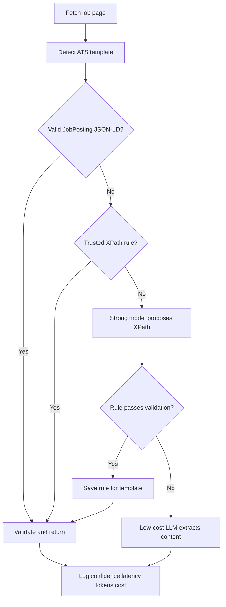

# Data Engineer Intern Take-Home Submission

## Executive summary

This submission implements both requested parts:

1. A reusable SmartRecruiters crawler with three company spiders.
2. A hybrid job-description extraction prototype that compares LLM-only extraction with reusable template rules and records quality, latency, tokens, and cost.

The production recommendation is rules first, structured data first within that rules path, and an LLM fallback only when validation fails. A strong model is used only to learn one reusable rule for a previously unseen template.

## Part 1: SmartRecruiters ATS extraction

### Method

SmartRecruiters exposes a public Posting API. The crawler uses two asynchronous GET requests:

- List active postings: `https://api.smartrecruiters.com/v1/companies/{companyIdentifier}/postings`
- Retrieve full posting details: `https://api.smartrecruiters.com/v1/companies/{companyIdentifier}/postings/{postingId}`

The list response is intentionally not treated as complete. Its `content` objects are summaries, and the API documentation instructs consumers to follow the posting reference for a full object. The implementation therefore paginates the list, filters English and recent postings, then schedules one Scrapy request per detail object.

References:

- [SmartRecruiters Posting API](https://developers.smartrecruiters.com/docs/posting-api)
- [SmartRecruiters public posting endpoints](https://developers.smartrecruiters.com/docs/endpoints)

### Files

- `jobs/spiders/SmartRecruitersBase.py`
- `jobs/spiders/spiders_in_SmartRecruiters.py`
- `tests/test_smartrecruiters.py`

The company spiders are:

| Spider | Company identifier | List endpoint |
|---|---|---|
| `VisaSmartRecruiters` | `Visa` | `https://api.smartrecruiters.com/v1/companies/Visa/postings` |
| `BoschGroupSmartRecruiters` | `BoschGroup` | `https://api.smartrecruiters.com/v1/companies/BoschGroup/postings` |
| `SmartRecruiters` | `smartrecruiters` | `https://api.smartrecruiters.com/v1/companies/smartrecruiters/postings` |

### Field mapping

| Required output | SmartRecruiters source | Fallback or transformation |
|---|---|---|
| `internalType` | Not required by public posting schema | Empty string from `JobsItem` default |
| `category_name` | Not required by public posting schema | Empty string from `JobsItem` default |
| `company_name` | Spider configuration | `company.name` |
| `job_title` | Detail `name` | Summary `name` |
| `job_href` | Detail `postingUrl` | `applyUrl` without query string, then canonical URL |
| `job_city_des` | `location.fullLocation` | Joined city, region, country; adds Remote when appropriate |
| `details_job` | `function.label` and `department.label` | Unique labels joined with ` - ` |

### Reliability behavior

- Paginates until `offset + returned_count >= totalFound`.
- Requests only English postings and checks the returned language again.
- Uses timezone-aware date comparison for the repository's two-day freshness rule.
- Supports `-a max_age_days=all` for a full-history demonstration.
- Keeps all network operations inside Scrapy instead of making blocking `requests` calls.
- Retries transient failures, throttles per domain, validates JSON shape, and logs malformed records without stopping the crawl.
- Preserves the starter project's location and tag-analysis hooks.

### Run

```bash
uv sync
uv run scrapy list
uv run scrapy crawl VisaSmartRecruiters -O items/visa-smartrecruiters.json
uv run scrapy crawl BoschGroupSmartRecruiters -a max_age_days=all -O items/bosch-smartrecruiters.json
uv run python -m unittest tests.test_smartrecruiters -v
```

The default two-day window follows the starter repository's rules. `max_age_days=all` is useful for a demo if a tenant has no posting released in the last 48 hours.

## Part 2: Job-description cleaning and structuring

### Final workflow



The key cost-control decision is that a strong model generates an XPath only once per unseen template. Every later page with that template uses deterministic extraction. If a stored rule stops producing sufficiently complete content, it is counted as a failure and the pipeline falls back rather than silently returning an empty or contaminated description.

### Prototype structure

| Component | Responsibility |
|---|---|
| `html_utils.py` | JSON-LD, XPath application, sanitization, text conversion, confidence signals |
| `templates.py` | ATS detection and built-in stable selectors |
| `rules.py` | Persistent rule registry with success/failure counts |
| `llm.py` | Structured LLM calls and exact token/cost accounting |
| `pipeline.py` | LLM-only, template-aware, and hybrid decision paths |
| `evaluation.py` | Per-page quality metrics and aggregate comparison |
| `cli.py` | Fetching, preparation, extraction, and benchmarking commands |
| `experiments/pages.json` | Ten selected live job-detail pages |

### Extraction modes

1. `llm_only`: cleans the HTML enough to reduce tokens, then sends every page to the low-cost model.
2. `template_aware`: tries JobPosting JSON-LD, a cached XPath, a built-in ATS XPath, then a strong-model-generated XPath. It does not call the low-cost content extractor.
3. `hybrid`: follows the template-aware path and uses low-cost LLM extraction only if deterministic validation fails.

### Confidence and failure handling

The prototype currently combines:

- Minimum description length.
- Presence of structural elements such as headings and bullet points.
- Penalties for cookie controls, application-form fields, sharing UI, related jobs, and privacy/footer content.
- A configurable acceptance threshold, defaulting to `0.65`.

This confidence is an operational routing signal, not the benchmark accuracy score. Production deployments should calibrate it on a larger labeled validation set. Rule success and failure counts make template drift observable.

### Metrics

Ground truth and extracted text are normalized into case-insensitive token multisets.

- Completeness = token recall against ground truth.
- Content accuracy = token F1.
- Contamination = `1 - precision`.
- Structure recall = preservation of bullet counts and short section-heading blocks.
- Successful full extraction = recall at least 98%, precision at least 98%, and structure recall at least 95%.
- Latency = end-to-end extraction wall time per page.
- Cost = actual input and output token counts multiplied by configured per-token prices.
- Estimated 100,000-page cost = observed mean cost per page multiplied by 100,000.

The threshold is deliberately strict so a short but plausible-looking summary cannot count as a full extraction.

### Model choices

- Low-cost content extraction: `gpt-5.6-luna`.
- Strong one-time rule generation: `gpt-5.6-sol`.

As of 2026-08-31, OpenAI lists standard short-context prices per one million tokens of $0.20 input and $1.20 output for GPT-5.6 Luna, and $4.00 input and $20.00 output for GPT-5.6 Sol. The choices separate the high-volume task from the low-frequency reasoning task. Prices are isolated in `llm.py` and should be checked immediately before the final experiment.

Reference: [OpenAI API pricing](https://developers.openai.com/api/docs/pricing)

The pipeline reads `OPENAI_API_KEY`, `LOW_COST_MODEL`, and `STRONG_MODEL` from environment variables. No credentials are stored in the repository.

Manifest entries can set `render: true` for JavaScript-only pages. Those pages are fetched with the starter project's Playwright dependency and passed through the same extraction and evaluation path.

### Ten selected pages

The dated manifest is `experiments/pages.json`. It includes seven ATS platforms and ten
companies/pages: SmartRecruiters, Greenhouse, Lever, Ashby, Workday, iCIMS, and Breezy.
SmartRecruiters and Greenhouse intentionally have repeated templates from different
companies so the experiment measures whether learned rules are actually reused.

Pages are intentionally marked `verified: false` until a person compares the prepared text with the rendered job page. The benchmark refuses to run on an unverified entry. This prevents a model-generated candidate from being mislabeled as ground truth.

### Ground-truth and benchmark procedure

```bash
export OPENAI_API_KEY='set-this-in-your-shell'
export LOW_COST_MODEL='gpt-5.6-luna'
export STRONG_MODEL='gpt-5.6-sol'

uv run python -m job_description_extraction.cli prepare-ground-truth \
  --manifest experiments/pages.json \
  --output-dir experiments/ground_truth_review
```

Preparation is resumable: pages that already have both saved HTML and a candidate
file are skipped, and one unavailable page does not prevent the remaining pages
from being prepared.

For each page:

1. Open the live page in a browser.
2. Compare every heading, paragraph, and bullet with the candidate text.
3. Add missing job content and remove unrelated content.
4. Save the approved text under `experiments/ground_truth/{id}.txt`.
5. Set that manifest entry's `verified` value to `true`.

Then run all three approaches:

```bash
uv run python -m job_description_extraction.cli benchmark \
  --manifest experiments/pages.json \
  --modes llm_only,template_aware,hybrid \
  --output-dir experiments/results
```

The command writes:

- `page_results.csv`: page-level quality, latency, model, tokens, and cost.
- `comparison.csv`: the required approach comparison table.
- `comparison.json`: machine-readable aggregates.
- `events_{mode}.jsonl`: separate extraction traces and warnings for each approach.
- `learned_rules_{mode}.json`: separate learned-rule registries so one approach cannot
  influence another approach's results.

The benchmark loads each page once and gives the exact same saved HTML to every
approach. It also starts every approach with a fresh rule registry. Use a new empty
results directory for each final run; the command refuses to reuse an existing
registry because doing so would make the comparison unfair.

### Final production recommendation

Use the hybrid approach with these priorities:

1. Prefer valid `JobPosting.description` structured data.
2. Apply a versioned, monitored template rule when one exists.
3. Ask a strong model to propose a rule for a new template and validate its output before caching it.
4. Fall back to low-cost LLM content extraction when a rule cannot be learned or a page has materially changed.
5. Send low-confidence results to retry or human review instead of silently accepting them.

This approach should approach LLM-only coverage while moving recurring templates toward near-zero marginal model cost. It is also more auditable because each deterministic result records the exact rule and template identity used.

## Known limitations before submission

- Live pages can expire or change; the ten-page ground truth and benchmark must be finalized close to the submission time.
- JavaScript-only pages such as some Ashby and Workday deployments use the optional Playwright fetch path. In production, direct ATS APIs are preferable when available because they are faster and easier to operate.
- The supplied environment must have network access to the selected job sites and valid model credentials for the empirical benchmark.
- The current 10-page set is appropriate for a take-home demonstration, not for statistically confident production thresholds.
